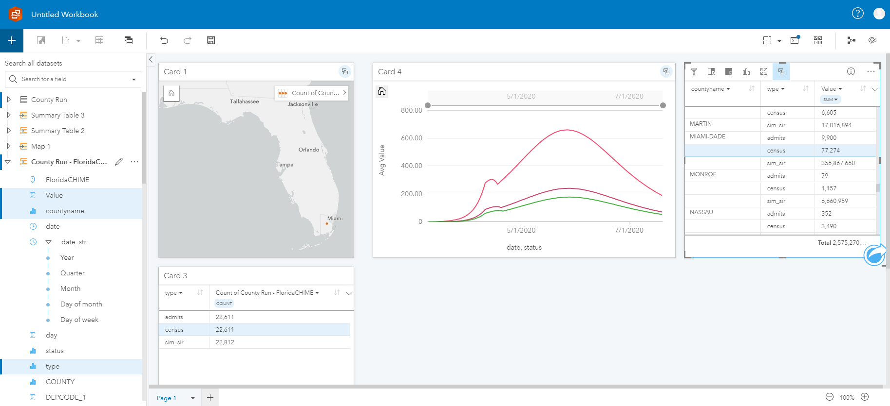

# ArcGIS Insights CHIME Script

Penn Medicine’s Predictive Healthcare Team adapted the susceptible, infected, and recovered (SIR) mathematical model, to create a new model it calls CHIME (COVID-19 Hospital Impact Model for Epidemics). The CHIME model provides up-to-date estimates of how many people will need to be hospitalized, and of that number how many will need ICU beds and ventilators.

The model uses a number of input parameters such as population size, percentage of infections, doubling time of the infection and, a additionally can include impacts of physical distancing measure such as stay-at-home directives.

This implementation, for ArcGIS Insights, allows for modelling of a single region, in which one value is required for these fields (column names):

_Fields / Column Names_

* Regional population
* Hospital market share (%)
* Currently hospitalized COVID-19 patients
* Doubling time in days
* Implementing physical distancing and start date is optional

This script can also be used to model multiple regions at once, for example, all counties in a state (see, cells 4 and 5).   

If you don't have ArcGIS Insights, you can download Insights Desktop [here](https://www.esri.com/en-us/arcgis/products/arcgis-insights/resources/desktop-client-download).  
 
1. Open Insights and create a new workbook
2. Click the _Add_ button and upload the Florida shapefile
3. Rename the uploaded dataset to FloridaCHIME
4. Open the scripting console and make a Jupyter Kernel Gateway connection
5. Import _CHIME.ipynb_ into the scripting console
6. Using the data in the FloridaCHIME drag and drop fields / column names into the second cell (setting the variable named __florida_df__)
7. Once step 5 is complete, run cell 1 and 2 to completion
8. Next execute cell 3
    1. This cell uses the magic command to load the merged dataset into Insights, ie ``` %insights_return(county_run_df) ```
9. After cell 3 executes a new layer will be added to the data pane, named "Layer".  Rename _Layer_ to _Florida_.
10. Next enable location on _Florida_, by clicking the ellipse and selecting _Enable Location_.  With the enable location dialog open, select the FloridaCHIME and choose the __CountyName__ field to match. 
11. Next drag and drop CHIME data fields from the datasets in the data pane to create interactive maps, charts, and tables


Please log an issue, if you need assistance using this script.

 
__Result image__

