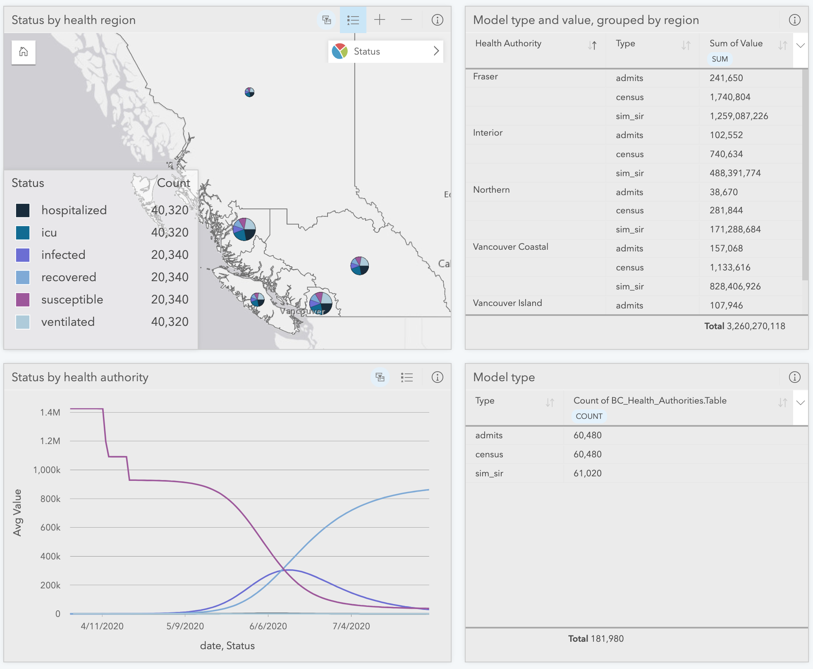

# Insights CHIME Script v4


The Script allows for an entire states counties to be processed in one go.  Alternatively, there is a commented out section that can be used to process many states to the county level.  In the former case, only county name is required for an individual state, in the latter case, both state name and county name fields will be required.

If you don't have ArcGIS Insights, you can download Insights Desktop [using this link](https://www.esri.com/en-us/arcgis/products/arcgis-insights/resources/desktop-client-download).
 
1. Open Insights 
2. Import the Florida shapefile and rename the dataset to FloridaCHIME
3. Open the scripting console and make a Jupyter Kernel Gateway connection
4. Import _CHIME.ipynb_ into the scripting console
5. Using the data in the FloridaCHIME drag and drop attributes below into the second cell (setting the variable named __florida_df__)
    1. Attributes: countyname, unacast_ch, hospitaliz, population, hospital_1
    2. Code before change: florida_df = #... ( DnD in front of the # sign)
    3. Code after change:  florida_df = FloridaCHIME ( 5 Fields)
6. Once step 5 is complete, run cell 1 and  2 until completion
7. Next execute cell 3
    1. This cell uses the magic command to load the merged dataset into Insights, ie ``` %insights_return(county_run_df) ```
8. After cell 3 executes a new layer will be added to the data pane, named "Layer".  Rename _Layer_ to _Florida_.
9. Next enable location on _Florida_, by clicking the ellipse and selecting _Enable Location_.  With the enable location dialog open, select the FloridaCHIME and choose the __CountyName__ field to match. 
10. Next drag and drop CHIME data fields from the datasets in the data pane to create interactive maps, charts, and tables

 
__Result image__

