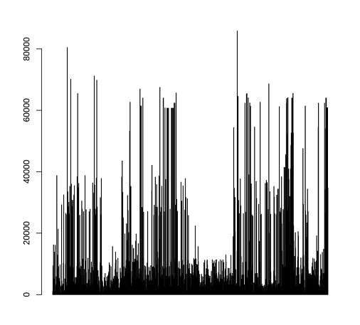

## Drag and drop data to the R console 

When you drag and drop a data from the Insights data pane to the Insights console, the dropped data is transformed to a R data frame list type.  The data frame column names will match field names from the dropped Insights dataset.  Below are examples, showing how to create charts via drag and drop with a few lines of R code.

When dragging data you can choose an entier layer or just choose fields you want.  In the console, when dropped data is represented using the below convention.

```layer.field```

ie. ```Allwear.salesamtho```


* Sample data named 'AllWear' is included in this folder.  To load the data, go to the Insights home page.  Click Datasets (on side navigation) and then click 'New Dataset' and select the AllWear.geojson file. 


### Histogram

```data_from_pane <- Allwear.salesamtho```

```hist(data_from_pane$salesamtho)```


### QQPlot

```data_from_pane <- Allwear.salesamtho```

```qqnorm(data_from_pane$salesamtho)```


### BarPlot

```data_from_pane <- Allwear.salesamtho```

```barplot(data_from_pane$salesamtho)```



### Plot

```data_from_pane <- Allwear.salesamtho```

```data_from_pane_qty <- Allwear.qty```

```plot(data_from_pane$salesamtho, data_from_pane_qty$qty)```


### Pie Chart

```data_from_pane <- Allwear.salesrep```

```pie(table(data_from_pane$salesrep))```


