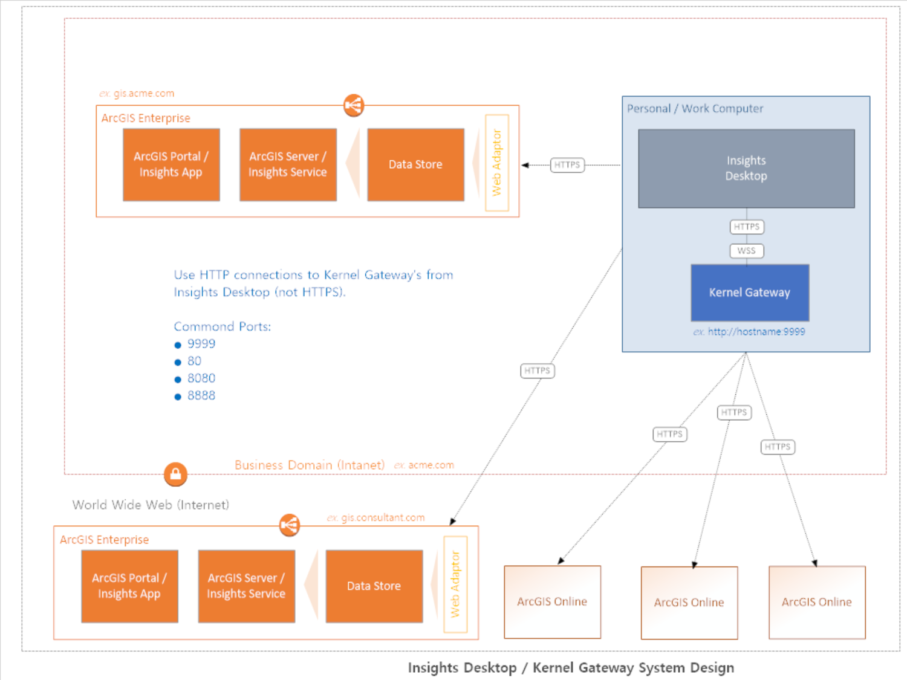
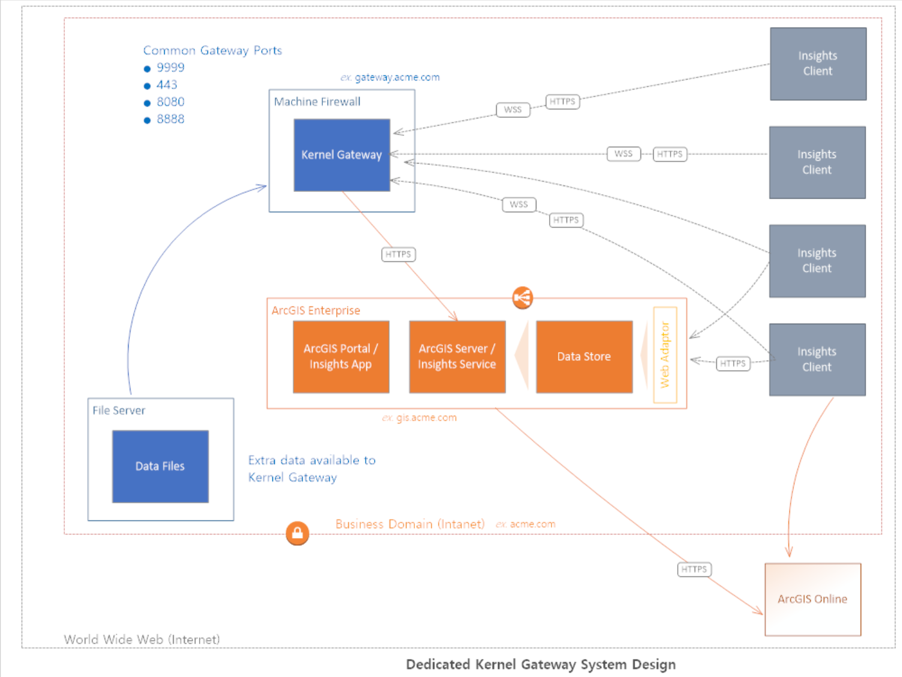
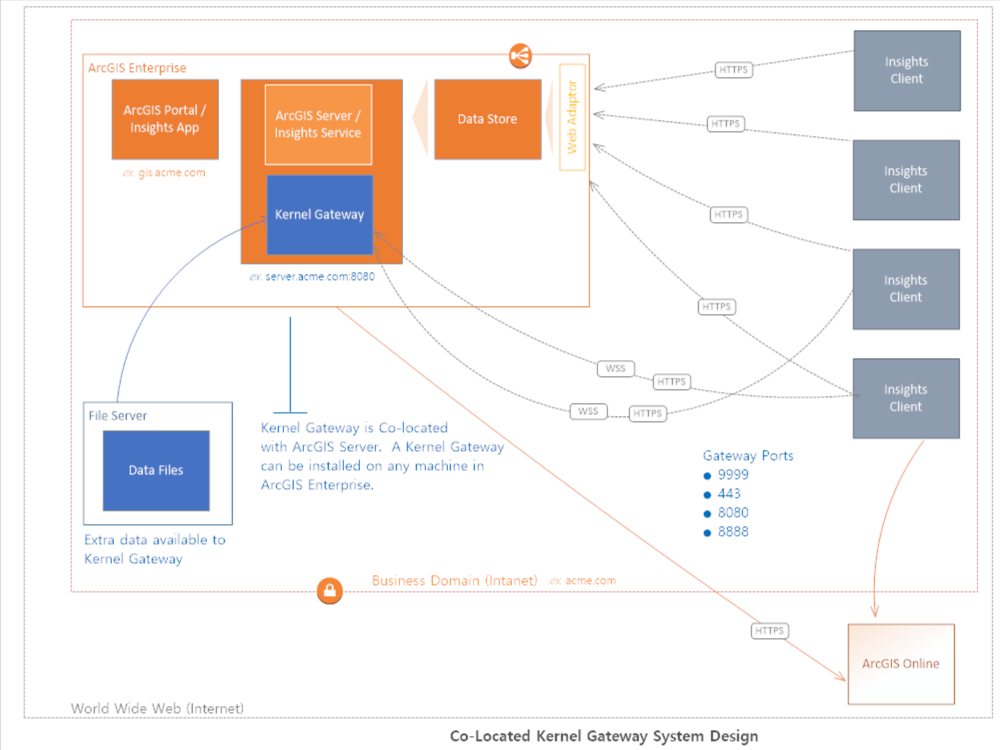
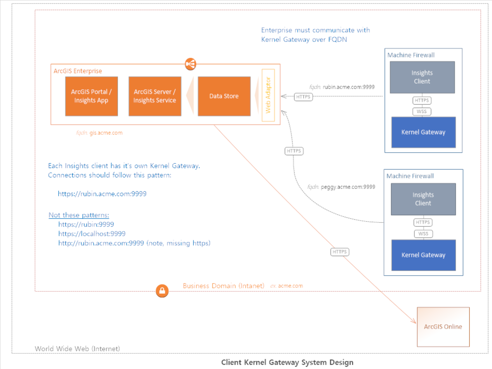
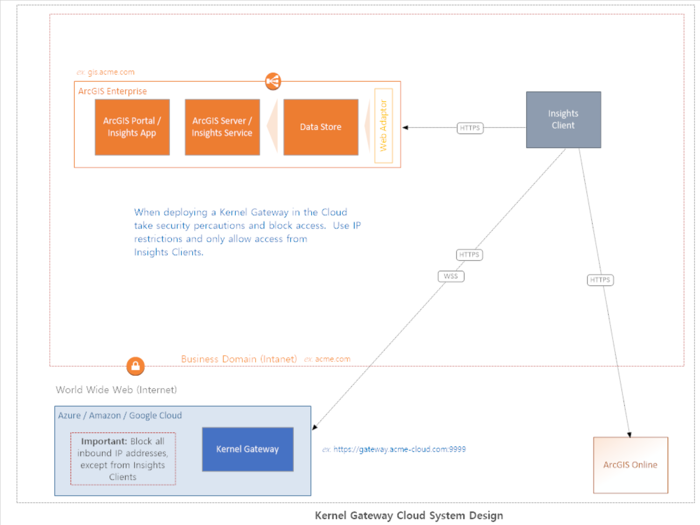

# Insights Scripting Guide

This guide offers a reference for creating custom features in ArcGIS Insights using Python and R.  It is the definitive guide for Insights scripting topics and a resource for implementing Jupyter's Kernel Gateway.
 

## Prerequisites

* ArcGIS Insights (version 2020.x)
* Anaconda (with Python version 3.7)
* See needed Python and R [dependencies](gateway/insights-base.yml) 

_Note: Scripting is not supported in Insights running in ArcGIS Online.  Please download [Insights Desktop](https://www.esri.com/en-us/arcgis/products/arcgis-insights/resources/desktop-client-download) for this instead, which supports ArcGIS Online connections, ArcGIS Enterprise connections, database and scripting features._ 

You can access an archived version of this documentation [here](README_OLD.md).


## Setup Kernel Gateway 

Insights supports connections to Jupyter's Kernel Gateway, which is an open source web server distributed through ```conda-forge``` and other repository channels.    To setup a Kernel Gateway, with the required dependencies choose one of the following deployment sections.

* [Deploy with Anaconda](#Deploy-with-Anaconda)
* [Deploy with Docker](#Deploy-with-Docker)

 Check out [Deployment Patterns](#Deployment-Patterns) for system planning recommendations.


### Deploy with Anaconda


1) Install [Anaconda](https://www.anaconda.com/distribution/#download-section)
2) Create a folder named ```gateway```
3) Copy ```selfsign.py``` into ```gateway``` folder
4) Depending on your Insights version, copy the appropriate ```.yml``` file into the ```gateway``` folder. For example: If you are using Insights 2020.2, copy ```insights-base-latest.yml```
5) Open _Anaconda's command prompt_ and CD into the ```gateway``` folder
6) Run below commands

    ```shell
    conda env create -f insights-base-latest.yml
    conda activate insights-base
    python selfsign.py
    ```

7) Start the Kernel Gateway:

* Run this command if using __Insights in ArcGIS Enterprise__

    ```shell
    jupyter kernelgateway --KernelGatewayApp.ip=0.0.0.0 --KernelGatewayApp.port=9999 --KernelGatewayApp.allow_origin='*' --KernelGatewayApp.allow_credentials='*' --KernelGatewayApp.allow_headers='*' --KernelGatewayApp.allow_methods='*' --JupyterWebsocketPersonality.list_kernels=True --certfile=./server.crt --keyfile=./server.key
    ```

* Run this command if using __Insights Desktop__

    ```shell
    jupyter kernelgateway --KernelGatewayApp.ip=0.0.0.0 --KernelGatewayApp.port=9999 --KernelGatewayApp.allow_origin='*' --KernelGatewayApp.allow_credentials='*' --KernelGatewayApp.allow_headers='*' --KernelGatewayApp.allow_methods='*' --JupyterWebsocketPersonality.list_kernels=True
    ```

8) _Optional:_  Stop Kernel Gateway by pressing _Control-C_ in the running window or close the window


### Deploy with Docker

1) Install [Docker](https://www.docker.com/products/docker-desktop)
2) Create a folder named ```gateway```
3) Copy ```selfsign.py``` and ```Dockerfile``` into ```gateway``` folder
4) Run ```selfsign.py``` to create certificates in the ```gateway``` folder

    ```shell
    python selfsign.py
    ```

5) Create a ```data``` folder within ```gateway``` and put your data files there
6) Run this command to create the Kernel Gateway Docker image

    ```shell
    docker build -t insights-gateway .
    ```

7) Start the Kernel Gateway

    ```shell
    docker run -p 9999:9999 insights-gateway
    ```


## Create a connection

To create a connection to your Kernel Gateway follow these steps: 


1) Open Insights
2) Create a new workbook
4) Click the _Scripting_ icon   
5) Complete Kernel Gateway connection form


_Note:_  Connections must reference the Kernel Gateway root URL.  For tips on what connections may look like see [Connection examples](#Connection-examples).  


## Connection examples

Urls may be HTTP or HTTPS.  Hosts can be referenced in numerous ways, IP address, localhost, FQDN etc.  You can use any available inbound port number that is not already in use.  If using 443, a connection  will not require the port number.  Here are some examples.  __Yes__ means connection schema is supported.  No, means that URL connection will likely fail (not work).


| Connection URL           | Insights in Enterprise | Insights Desktop  |
| ------------- |:-------------:|:-----:|
| http://localhost:9999      | no | yes |
| https://localhost:9999      | no      |   no |
| http://pickle:9999| no      |    yes |
| https://pickle:9999| no      |    no |
| http://12.120.95.153:9999 | no      |    yes |
| https://12.120.95.153:9999| yes      |    no |
| http://pickle.esri.com:9999| no      |    yes |
| https://pickle.esri.com:9999| yes      |    no <sup>1</sup> |

<sup>1</sup> Insights Desktop can make connections to HTTPS Kernel Gateway endpoints, if the Kernel Gateway uses a domain or a certificate authority certificate.

<sup>2</sup> If using port 443, the connection url will look like this ``` https://pickle.esri.com ```.

_Note:_ In Chrome, when trying to access the gateway url, it will give you a "Your connection is not private" warning. Click somewhere on the page and then blindly type the word `thisisunsafe`. This will instantly bypass the warning.

## General Features

Python and R scripting features are distributed across the app.  Shared scripts are accessed from the _Add_ dialog.  Script modules and module options are accessed via the _Data Pane_. Lastly, the _Console_ itself has many script features.  Refer to this table for an overview of tools and capabilities.

| Icon           | Tool Name | Description  |
| :-------------: |:-------------:| :-----|
|       | Open console | Opens the Python and R scripting console or Kernel Gateway connection dialog. If no Kernel Gateway connection exists within the page, this is when the connection dialog openes. |
|      | Create module      |   Creates a script from selected cells then adds a module to the data pane. |
| | Create card      |    Takes the active cell and creates a card. |
| | Delete cell      |    Deletes the active cell. |
|  | Export script      |    Enables saving of cell (or cells) to common formats like Python, R, or Jupyter Notebook files. |
|  | Import file      |    Enables importing of scripts into the console from common files like Python, R or Jupyter Notebook files. |
|  | Insert cell      |    Inserts a new scripting cell. |
| | Restart kernel      |    Restarts the execution kernel within the Kernel Gateway.  Restarting stops running scripts and clears the namespace and any data held in memory.  |
| | Run  | Runs script in active cell. |
|  |    Run all  | Runs all scripts in active cell. |
| | Switch connection      |    Enables connection changing from one Kernel Gateway to another.  |


### Shortcuts

The console enables keyboard shortcuts to perform routine tasks quickly.

| Shortcut           | Description |
|:-------------:|:-------------|
| __Ctrl + B__     | Create comments for selected code. |
| __Shift + Enter__      | Executes code in current cell. |
| __Ctrl + Alt + B__         | Adds ```%insights_return(<data frame object>)``` magic command to cell  |


### Magic commands

The console supports the following magic command.  This magic command must be placed in it's own cell.

| Magic command           | Description |
|:-------------:|:-------------|
| ```%insights_return(<data frame object>)```     | Converts Python or R data frames into Insights datasets.  When ```%insights_return(df)```  is run it will generate an Insights dataset from the ```df``` object.  Data will be persisted in the workbook (when the workbook is saved) and will appear in the data pane after execution.  |


## Deployment Patterns

There are various configurations to choose from when planning a Jupyter Kernel Gateway with Insights.  It should be noted that some configurations may have tactical advantages over others.  Additionally, each configuration will offer different end user experiences and varying degrees of effort regarding setup and maintenance.

These conceptual diagrams were designed to help organizations visualize different kinds of Jupyter Kernel Gateway configurations next to different kinds of Insights deployments. 

### Insights Desktop and Kernel Gateway




* This configuration entails low newtworking and firewall considerations
* Data files may live on personal computer or file server


### Insights in ArcGIS Enterprise and Kernel Gateway  

#### Dedicated



* This configuration entails moderate networking and firewall considerations and skills
* Data files should live on file server or Kernel Gateway machine


#### Co-Located



* This configuration entails moderate networking and firewall considerations and skills
* Data files should live on file server or Kernel Gateway machine


#### Client Kernel Gateway System Design



* This configuration entails moderate networking and firewall considerations and skills
* Data files may live on personal computer or file server


### Cloud Kernel Gateway 

* Data files may need to be accessible from the cloud
* This configuration entails advanced networking and firewall skills and considerations




## What is ArcGIS Insights?

Part of the Esri Geospatial Cloud, ArcGIS Insights is data analytics made for advanced location intelligence. Using Insights you can ask questions you did not know to ask, analyze data completely, and tell powerful data stories. Connect to your data directly, then use maps, charts, tables and reuseable models and scripts to perform basic to complex analyses that scale based on skill level and business need.

* [Case studies and testimonials](https://www.esri.com/en-us/arcgis/products/insights-for-arcgis/overview)
* [Product and analytical tool documentation](https://doc.arcgis.com/en/insights/)


## FAQs and Troubleshooting

#### How do I install additional Python libraries using the console that are not in my Kernel Gateway?

You can do this by putting an explanation point in front of a _pip install_ command. Like,

```
!pip install BeautifulSoup4
```

If all goes well (after running the command), download activity will apear in the output cell.  When the command finishes, you can then import your library and run scripts like normal. 

```py
from bs4 import BeautifulSoup
soup = BeautifulSoup("<p>Hello Insights!</p>")
print(soup.prettify())
```  


#### Insights is running in the web browser and when making a Kernel Gateway connection it says "_Not able to add this connection. Try with a different URL or web socket or check if your gateway is running._"


If you've followed the guide (and ran the selfsign.py file), you have created a self signed SSL certificate. It may be possible that Insights cannot make a connection because the web browser itself does not trust the certificate. To work around this problem open the kernel gateway URL in the web browser and accept the browser warning. Then try connecting again.


#### My Kernel Gateway is on a different machine and I am having trouble making a connection using Insights?

A fundamental way to troubleshoot this problem is confirm that all needed computers can talk to each other.   If you are running Insights in Enterprise this means each ArcGIS Server machine, plus your Kernel Gateway and personal computer must all be able to communicate with each other.   Insights Desktop entails less troubleshooting.  For Insights Desktop deployments, only the Kernel Gateway and your personal computer need to talk to each other.

 Try getting the IP address of:
 
 * Your personal computer machine
 * Your kernel gateway machine
 * Your ArcGIS Server machine(s) 
 
 and then from each machine run the ```ping``` command to see if ping messages are received. 

Tip:  On windows, run ```ipconfig``` and reference the Iv4 address to get the IP address.  On mac, run ```ipconfig getifaddr en0``` and note the address.  


## Get Insights Desktop

[Download Insights Desktop](https://www.esri.com/en-us/arcgis/products/arcgis-insights/resources/desktop-client-download)


## Licensing
Copyright 2020 Esri

Licensed under the Apache License, Version 2.0 (the "License");
you may not use this file except in compliance with the License.
You may obtain a copy of the License at

   http://www.apache.org/licenses/LICENSE-2.0

Unless required by applicable law or agreed to in writing, software
distributed under the License is distributed on an "AS IS" BASIS,
WITHOUT WARRANTIES OR CONDITIONS OF ANY KIND, either express or implied.
See the License for the specific language governing permissions and
limitations under the License.

A copy of the license is available in the repository's [license.txt]( https://raw.github.com/Esri/quickstart-map-js/master/license.txt) file.
