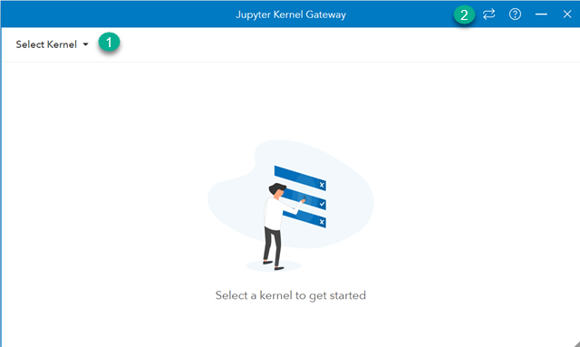
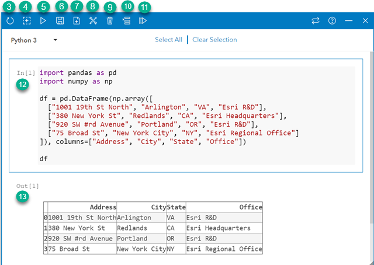

# Insights Scripting Guide

This guide offers a reference for creating custom features in ArcGIS Insights using Python and R.  It is the definitive guide for Insights scripting topics and a resource for implementing Jupyter's Kernel Gateway.
 

## Prerequisites

* ArcGIS Insights (version 2020.x)
* Anaconda (version 3.7)
* See needed Python and R [dependencies](gateway/insights-base.yml) 

_Note: Insights in ArcGIS Online does not support scripting.  Please use Insights Desktop until this becomes a supported feature._ 


## Kernel Gateway Setup 

Insights supports connections to Jupyter's Kernel Gateway version 2.1.0, which is an open source web server distributed through ```conda-forge``` and other channels.  To learn how to setup a Kernel Gateway with the required dependencies choose one of the following deployment sections.

* [How to deploy a Kernel Gateway with dependencies using Anaconda](#How-to-deploy-a-Kernel-Gateway-with-dependencies-using-Anaconda)
* [How to deploy a Kernel Gateway with dependencies using Docker](#How-to-deploy-a-Kernel-Gateway-with-dependencies-using-Docker)

Insights Desktop readers should review [How to deploy a Kernel Gateway for Insights Desktop](How-to-deploy-a-Kernel-Gateway-for-Insights-Desktop). 

### How to deploy a Kernel Gateway with Anaconda

It's reccomended to read [Planning a Scipting Environment](#Planning-a-Scripting-Environment) before following these steps.

1) Install [Anaconda v3.7](https://www.anaconda.com/distribution/#download-section)
2) Create a folder named ```gateway```
3) Copy ```selfsign.py``` and ```insights-base.yml``` into ```gateway``` folder
4) Open _Anaconda's command promt_ and CD into the ```gateway``` folder
5) Run below commands

    ```
    conda env create -f insights-base.yml
    conda activate insights-base
    python selfsign.py
    ```

6) Start the Kernel Gateway:

* Run this command if using __Insights in ArcGIS Enterprise__

    ```
    jupyter kernelgateway --KernelGatewayApp.ip=0.0.0.0 --KernelGatewayApp.port=9999 --KernelGatewayApp.allow_origin='*' --KernelGatewayApp.allow_credentials='*' --KernelGatewayApp.allow_headers='*' --KernelGatewayApp.allow_methods='*' --JupyterWebsocketPersonality.list_kernels=True --certfile=./server.crt --keyfile=./server.key
    ```

* Run this command if using __Insights Desktop__

    ```
    jupyter kernelgateway --KernelGatewayApp.ip=0.0.0.0 --KernelGatewayApp.port=9999 --KernelGatewayApp.allow_origin='*' --KernelGatewayApp.allow_credentials='*' --KernelGatewayApp.allow_headers='*' --KernelGatewayApp.allow_methods='*' --JupyterWebsocketPersonality.list_kernels=True
    ```

7) _Optional:_  Stop Kernel Gateway by pressing _Control-C_ in the running window or close the window


### How to deploy a Kernel Gateway with dependencies using Docker

...Coming soon...


## Create a connection

To create a Jupyter Kernel Gateway connection complete the Kernel Gateway Connection form. 


1) Open Insights
2) Click the _Scripting_ icon 
3) Complete Kernel Gateway Connection form


_Note:_  This form needs the root URL of your Kernel Gateway.  For tips on choosing the correct URL schema, it's reccomended to read [Kernel Gateway URL Patterns](#Kernel-Gateway-URL-Patterns).  


## Kernel Gateway URL Patterns


| URL           | Insights in Enterprise | Insights Desktop  |
| ------------- |:-------------:| -----:|
| http://localhost:9999      | no | yes |
| https://localhost:9999      | no      |   no |
| http://pickle:9999| no      |    yes |
| https://pickle:9999| no      |    no |
| http://12.120.95.153:9999 | no      |    yes |
| https://12.120.95.153:9999| yes      |    no |
| http://pickle.esri.com:9999| no      |    yes |
| https://pickle.esri.com:9999| yes      |    no <sup>1</sup> |

<sup>1</sup> Insights Desktop can make connections to HTTPS Kernel Gateway endpoints, if the Kernel Gateway uses a domain or a certificate authority certificate.


## Learn about Insights scripting features within the console







### Learn about shortcuts and magic commands

The console uses keyboard shortcuts and magic commands so routine tasks can be performed quickly and efficiently.
* Use the ```%insights_return(<R data frame or Pandas DataFrame>)``` magic command to make R or Python data frames available to Insights.  Following the command, your data frame data will appear in the data pane,  just like other layers and datasets do.

&nbsp;&nbsp;&nbsp;&nbsp;__The %insights_return magic command must be run on a single line in a single cell in the ArcGIS Insights Console__

* ``` Ctrl/control + Alt/option + B ``` Add ```%insights_return``` magic command to cell.
* ``` Ctrl/control + / ``` Comment line.
* ``` Ctrl/control + Spacebar ``` Enable code suggestions (IntelliSense).
* ``` Shift/shift + Enter/return ``` Execute the code in the current cell.


## Planning a Scipting Environment

There are various configurations to choose from when planning a Jupyter Kernel Gateway deployment.  It should be noted that some configurations make have a tactical advantage over others.  Additionally, each configuration will offer different end-user experiences and varying degress of effort in regards to deployment and maintence.

These conceptual diagrams were designed to help organizations visualize different Jupyter Kernel Gateway configurations. 

### Insights Desktop and Kernel Gateway


* This configuration entails low newtworking and firewall considerations
* Data files may live on personal computer or file server


### Insights in ArcGIS Enterprise and Kernel Gateway  

#### Dedicated


* This configuration entails moderate newtworking and firewall considerations and skills
* Data files should live on file server or Kernel Gateway machine


#### Co-Located


* This configuration entails moderate newtworking and firewall considerations and skills
* Data files should live on file server or Kernel Gateway machine


#### Client Kernel Gateway System Design


* This configuration entails moderate newtworking and firewall considerations and skills
* Data files may live on personal computer or file server


### Cloud Kernel Gateway 

* Data files may need to be accessible from the cloud
* This configuration entails advanced newtworking and firewall skills and considerations


## Troubleshooting 

_Insights is running in the web browser and when connecting to a Kernel Gateway an error says "Not able to add this connection. Try with a different URL or web socket or check if your gateway is running."_

If you've followed the guide (and ran the selfsign.py file), you have created a self signed SSL certificate. It may be possible that Insights cannot make a connection because the web browser itself does not trust the certificate. To work around this problem open the kernel gateway URL in the web browser and accept the browser warning. Then try connecting again.


_My Kernel Gateway is on a different machine and I am having trouble making a connection using Insights?_

A fundemental way to toubleshoot this problem is confirm that all needed computers can talk to each other.   If you are running Insights in Enterprise this means each ArcGIS Server machine, plus your Kernel Gateway and personal computer must all be able to communicate with each other.   Insights Desktop entails less troubleshooting.  For Insights Desktop only the Kernel Gateway and your personal computer need to talk to each other.

 Try getting the IP address of:
 
 * Your personal computer machine
 * Your kernel gateway machine
 * Your ArcGIS Server machine(s) 
 
 and then from each machine run the ```ping``` command to see if ping messages are received. 

Tip:  On windows, run ```ipconfig``` and reference the Iv4 address to get the IP address.  On mac, run ```ipconfig getifaddr en0``` and note the address.  


## Contribute

If you wish to contribute or have questions, please create an issue or pull request.


## Start using ArcGIS Insights with a Free Trial

Sign-up to [start a free trial](https://www.esri.com/en-us/arcgis/products/insights-for-arcgis/trial?adumkts=product&adupro=Insights_for_ArcGIS&aduc=pr&adum=blogs&utm_Source=pr&aduca=arcgis_insights_existing_customers_promotions&aduat=blog&aduco=exploring-the-atlantic-ocean-in-insights&adupt=lead_gen&sf_id=70139000001eKGfAAM).


## Licensing
Copyright 2020 Esri

Licensed under the Apache License, Version 2.0 (the "License");
you may not use this file except in compliance with the License.
You may obtain a copy of the License at

   http://www.apache.org/licenses/LICENSE-2.0

Unless required by applicable law or agreed to in writing, software
distributed under the License is distributed on an "AS IS" BASIS,
WITHOUT WARRANTIES OR CONDITIONS OF ANY KIND, either express or implied.
See the License for the specific language governing permissions and
limitations under the License.

A copy of the license is available in the repository's [license.txt]( https://raw.github.com/Esri/quickstart-map-js/master/license.txt) file.
