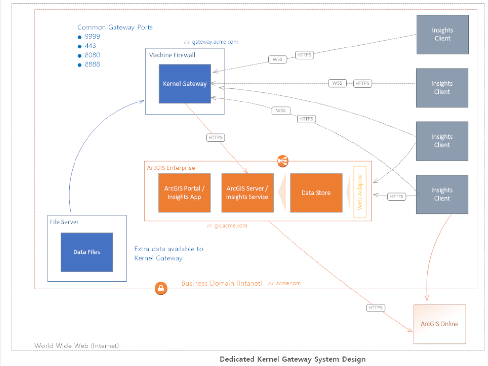
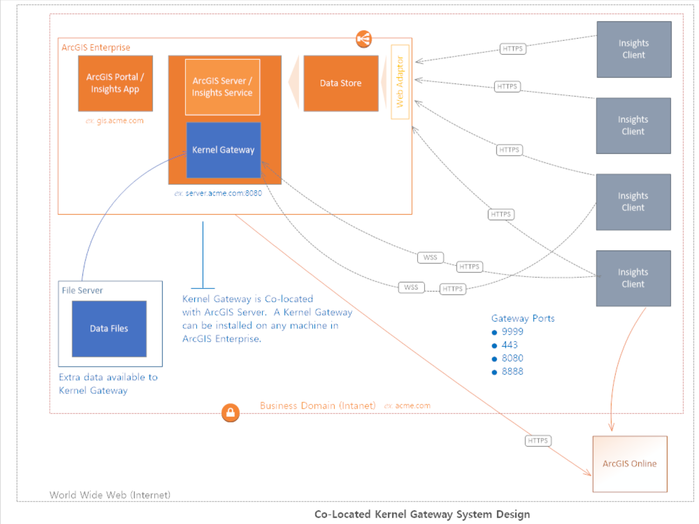

## Kernel Gateway Deployment Planning 

Want to learn more about deploying a Jupyter Kernel Gateway?  These conceptual diagrams were designed to help organizations visualize different Jupyter Kernel Gateway configurations. 

### Insights Desktop

### ArcGIS Enterprise with Insights and Kernel Gateway  

#### Dedicated

#### Co-Located

#### Client Kernel Gateway System Design

### On-premises ArcGIS Enterprise with Insights Insights and Cloud Kernel Gateway

*Other configurations and designs may exisit.