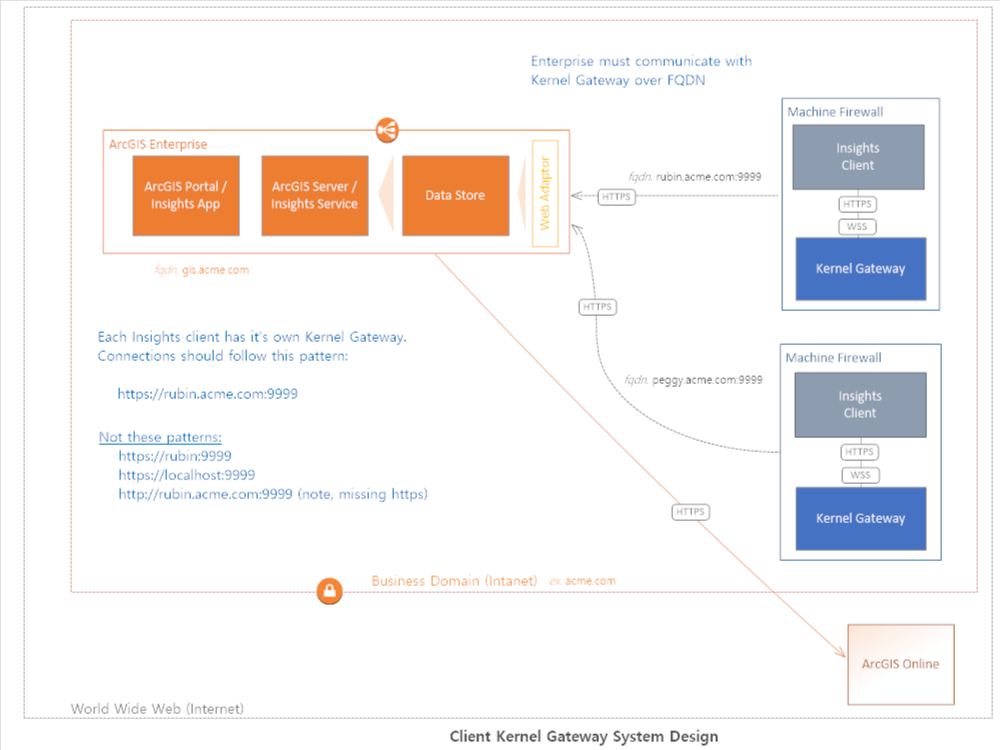

## Kernel Gateway Deployment Planning 

Are you Instested in Insights Scripting and want more about deploying a Jupyter Kernel Gateway?  These diagrams are ment to help organizations plan a Jupyter Kernel Gateway deployment. 

### Insights Desktop

### ArcGIS Enterprise with Insights and Kernel Gateway  

#### Dedicated

#### Co-Located

#### Client Kernel Gateway System Design

### On-premises ArcGIS Enterprise with Insights Insights and Cloud Kernel Gateway

*These diagrams are ment to be a conceptual reference. Other configurations and designs exisit.